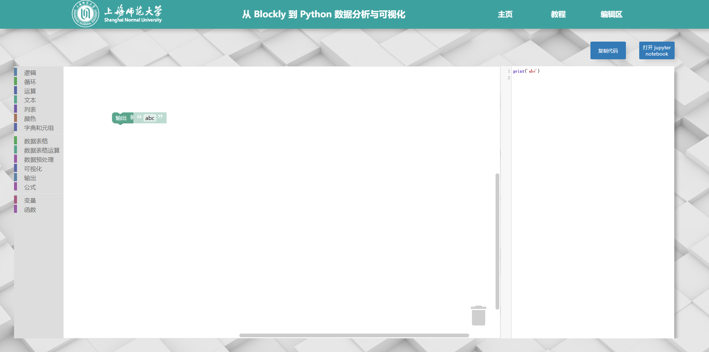
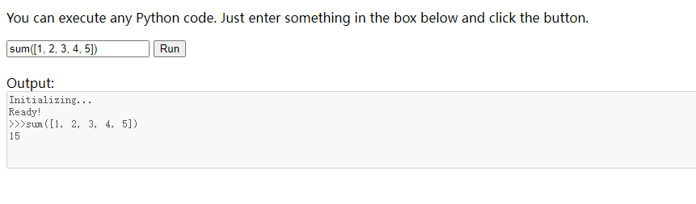
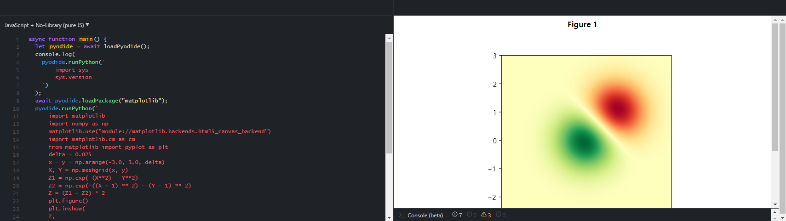
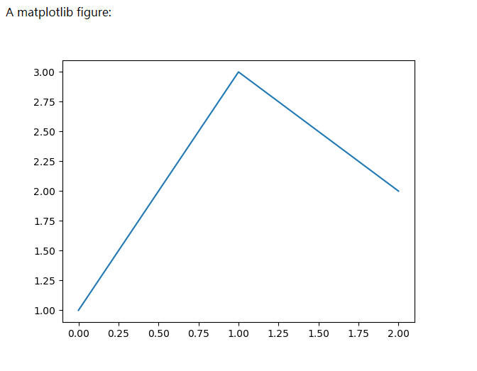
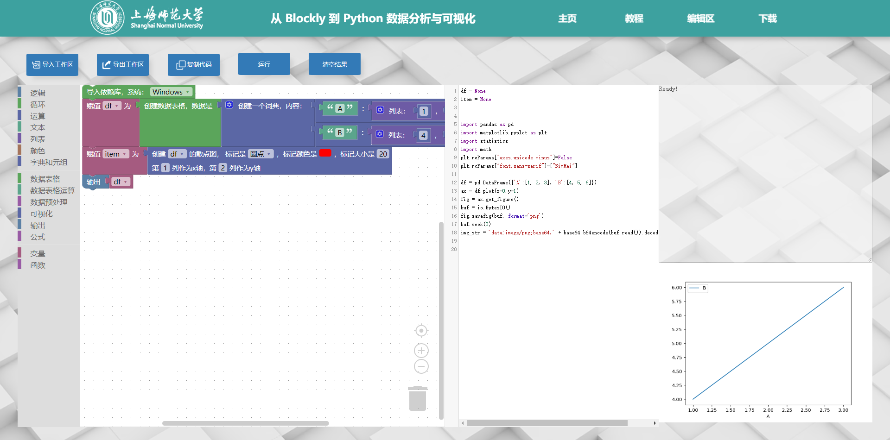

实验室二次开发一个blockly平台，这是一个积木化编程平台，可从积木生成各种语言代码，如Python。界面如下，积木到代码由原blockly库提供，不难。
而运行python代码刚开始是放在jupyter notebook，手动复制过去运行。

进一步优化的方案就是在线运行（在浏览器）Python代码。基本库的浏览器化不难，但是之前一直没找到可以运行第三方库如pandas的js库。这次看到[pyodide](https://pyodide.org/en/stable/index.html)，可以实现第三方库的导入。于是开始折腾。

# 初步运行pyodide

直接看官网的例子，可以直接跑python基础库：

    <!DOCTYPE html>
    <html>
    <head>
        
    </head>

    <body>
        

        You can execute any Python code. Just enter something in the box below and
        click the button.
        

        <input id="code" value="sum([1, 2, 3, 4, 5])" />
        <button onclick="evaluatePython()">Run</button>
         
         
        
Output:

        <textarea id="output" style="width: 100%;" rows="6" disabled></textarea>

        
    </body>
    </html>

# print问题

基本库python代码可以正常运行，但是运行`print('abc')`函数时，发现打印的东西不在返回的结果里，而是在console里。幸运的是这个问题也有[issue](https://github.com/pyodide/pyodide/issues/8)。

这个issue下面的[这个回答](https://github.com/pyodide/pyodide/issues/8#issuecomment-772024841)提供了一种方法，可以将执行的代码的输出转到返回结果，而不是console。

    
    
    

注意他用的是v0.16.1版本pyodide，最新的0.21.3会报错。但是思路很好，贴一下我自己修改的0.21.3版本代码,原理就是把运行的代码当作参数输入预先运行的run_code函数：

    

    

# 画图显示问题

这下print没问题了，下面解决画图的问题。上面的
    
    await pyodide.loadPackagesFromImports(code_to_run);

会自动识别import并导入对应python库的js版本。但是matplotlab画图没法直接出来。我找了两个解决方法

- 修改matplotlab的[backends](https://matplotlib.org/stable/users/explain/backends.html#selecting-a-backend)，可以把图片输出成canvas在页面中显示
- 保存图片的base64编码，然后html中的img读取base64编码显示图片

**第一个方法**参考这个[blog](https://blog.pyodide.org/posts/canvas-renderer-matplotlib-in-pyodide/)，里面提到的这个[demo](https://jsfiddle.net/gh/get/library/pure/pyodide/pyodide-blog/contents/demos/canvas-renderer-matplotlib/demo-1/)用处很大，直接显示了如何从matplotlab显示图像到网页。

使用方法就是在运行的python代码里，最前面加上

    import matplotlib
    matplotlib.use("module://matplotlib.backends.html5_canvas_backend")

指定matplotlab的backend为html5_canvas_backend，就可以生成canvas了，但是有个问题是我不知道如何控制这个canvas的位置，于是使用第二个方法。

**第二个方法**参考这个[网页](https://codepen.io/aagostini/pen/LYExVJL?editors=1000)，虽然它的pyodide.js链接失效了看不出效果，但是可以修改一下，看到matplotlab作图出现在html上了：

代码如下：

    <!doctype html>
    <meta charset="utf-8">
    <html lang="en">
    <html>
    <head>
        <title>Demo</title>
        
    </head>
    <body>
    </body>
        

        
A matplotlib figure:

        

    <html>

# 整合

把解决print的方法和第二个输出图片的方法结合起来有点小插曲，一开始修改runPython()
    
    async function runPython() {
        // run code currently stored in editor
        let code_to_run = editor.getValue()
        await pyodide.loadPackagesFromImports(code_to_run);
        pyodide.globals.set('code_to_run',code_to_run);
        addToOutput(pyodide.runPython('run_code(code_to_run)'));

        let a = pyodide.globals.get('img_str')
        if(a){
            pyplotfigure.src=a
        }
    }

但是`let a = pyodide.globals.get('img_str')`一开始提示无法找到img_str，后来发现是namespace的锅：

     exec(_code,namespace)

这个会在一个新的namespace里执行，所以在外面找不到里面定义的img_str，改为

    exec(_code,globals())

使用全局的namespace，就可以看到图片了

最后代码：

js：

    

    
html要加上放图片的地方：

    
    

最后展示一下：

