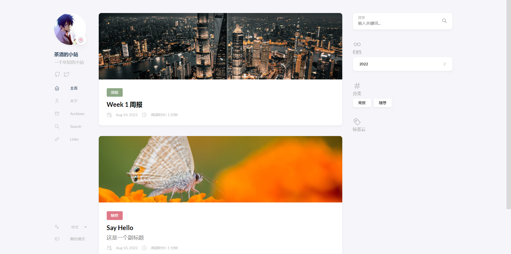
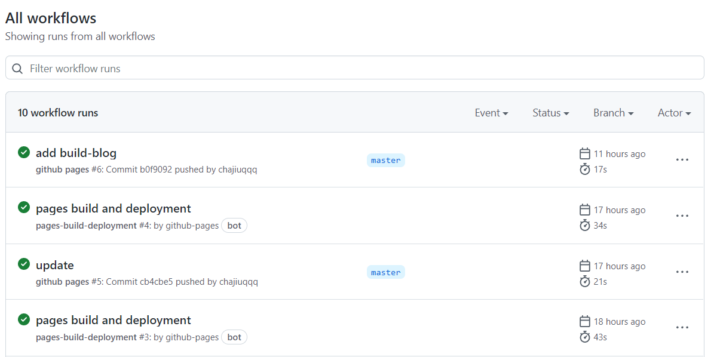
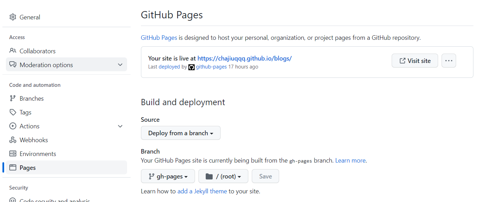

应该算是第一篇比较正式的blog吧，前几天把bolg搭起来了，今天又实现了持续集成，可以实现一个仓库保存blogs和网站页面，并在更新的时候自动构建+部署网站。这种构建方式最大的好处是免费+资料掌握+自动部署，那下面就来介绍一下怎么实现。

## 使用流程

在多台设备上可clone一个仓库，使用hugo或手动在content/post下新建md文件攥写文章，完成后git提交并推送远程仓库，远程仓库会自动构建网站，用户等一会就可以看到网站更新了。

编写环境只要有git即可完成编写+部署流程（当然添加了hugo在创建文章时会更方便啦，而且可以本地看到效果）。

## 搭建逻辑

博客可以是静态的，也可以是动态的。静态的就是一堆由HTML和CSS、JS组成的文件直接被浏览器访问，没有后台程序提供业务支持，好处是不吃资源，访问只受网络带宽限制，坏处是没法做业务处理了；

动态指的是由前端+后端组合支持的网站，好处是可以做自由的业务和管理，坏处是部署麻烦，对资源需求大，并发访问受到服务器性能限制。

为了便于维护，本文搭建的是静态网站。



采用技术是
- Markdown：文章编写语法
- Hugo：静态网站编译工具
- GitHub Page：网页托管
- GitHub Action：自动构建服务

Hugo的使用逻辑是，我们编写markdown格式文章，并附加某种格式的数据，写好后交给Hugo工具“构建”生成静态的HTML和CSS、JS组成的文件，这些文件统一放在public文件夹下，此时部署public就可以看到你的网站了。

其中一个缺点是每次需要Hugo的环境来“构建”，并需要维护两套代码：文章源代码和网站代码

当结合Github Action时，可以把这个构建过程交给云端处理。每次主分支推送时都会触发这个“构建”，同时把public下的文件推送到`gh-page`分支，利用Github Page挂载你的网站，这样网站就更新好并可以浏览了。

## 搭建步骤

### 1、安装hugo

Hugo没有一键安装包，可以使用包管理工具安装，[MacOS用brew](https://gohugo.io/getting-started/quick-start/#step-1-install-hugo)，Windows用[chocolatey](https://chocolatey.org/)。各个系统安装[看这](https://gohugo.io/getting-started/installing)

```
MacOS:
brew install hugo

Windows:
choco install hugo -confirm
```
安装完成后使用`hugo new site quickstart`创建`quickstart`文件夹作为网站主目录。进入目录，使用`hugo new posts/my-first-post.md`创建一个新的文章。然后把`draft: true`删除或者改为`draft: false`，这样就公开文章咯。

更多Hugo使用教程参考[这个](https://gohugo.io/getting-started/quick-start/)


### 2、添加Github Action

官方文档里有[说明](https://gohugo.io/hosting-and-deployment/hosting-on-github/#build-hugo-with-github-action),这里概述一下：

1. 在你的项目下创建`.github/workflows/gh-pages.yml`这个路径的文件
2. 复制这一段进去,注意下面两个`main`的地方，如果你用`master`，则改成`master`

```
name: github pages

on:
  push:
    branches:
      - main  # Set a branch to deploy
  pull_request:

jobs:
  deploy:
    runs-on: ubuntu-20.04
    steps:
      - uses: actions/checkout@v2
        with:
          submodules: true  # Fetch Hugo themes (true OR recursive)
          fetch-depth: 0    # Fetch all history for .GitInfo and .Lastmod

      - name: Setup Hugo
        uses: peaceiris/actions-hugo@v2
        with:
          hugo-version: 'latest'
          # extended: true

      - name: Build
        run: hugo --minify

      - name: Deploy
        uses: peaceiris/actions-gh-pages@v3
        if: github.ref == 'refs/heads/main'
        with:
          github_token: ${{ secrets.GITHUB_TOKEN }}
          publish_dir: ./public
```

### 3、添加仓库

初始化好网站后，使用git初始化仓库，并提交。
```
git init
git add .
git commit -m "init"
```
在github上创建新仓库，这个仓库名称可以是`用户名.github.io`，或者别的。最后访问地址是`用户名.github.io`或者`用户名.github.io/仓库名`.不需要readme。然后本地仓库添加远程仓库，并推送。

推送成功后，Action会自动build网站并推送到`gh-pages`分支。**因此我们使用一个仓库的不同分支来管理文章源代码和网站代码。**



### 3、设置GitHub Page

在项目设置里选择Pages，初次构建需要指定哪个分支的代码用作Page，选择`gh-pages`分支并保存即可，上方会给出可以访问的地址。我的仓库名称是blogs，因此地址是 https://chajiuqqq.github.io/blogs/ ，试试访问你的网站，应该可以看到第一篇文章咯。




### 5、再发布一篇新文章

- 进入网站目录，新建文章
  ```
  hugo new posts/second-post.md
  ```

- 在vscode或其他markdown编辑器中编写文章，记得把draft取消哦
- git提交并推送
- 等待网站自动构建
- 访问网站

是不是很方便呢

## 最后

hugo提供了很多好看的[主题](https://themes.gohugo.io/)，参考主题指南进行更换哦，比如我使用的[hugo-theme-stack](https://github.com/CaiJimmy/hugo-theme-stack)


配置方法就是在网站目录下添加这个库
```
git submodule add https://github.com/CaiJimmy/hugo-theme-stack themes/hugo-theme-stack
```
并修改`config.yaml`，这个可以直接复制`hugo-theme-stack`下`examplesite`的`config.yaml`再修改哦。最主要的就是`baseurl`换成你的网站地址即可！下面贴上我的配置.

> The End

```
baseurl: https://chajiuqqq.github.io/blogs/
languageCode: en-us
theme: hugo-theme-stack
paginate: 5
title: 茶酒的小站

languages:
  en:
    languageName: English
    title: Chajiu's blog
    weight: 1
  zh-cn:
    languageName: 中文
    title: 茶酒的小站
    weight: 2
  ar:
    languageName: عربي
    languagedirection: rtl
    title: موقع تجريبي
    weight: 3

# Change it to your Disqus shortname before using
disqusShortname: hugo-theme-stack

# GA Tracking ID
googleAnalytics: 

# Theme i18n support
# Available values: ar, bn, ca, de, el, en, es, fr, hu, id, it, ja, ko, nl, pt-br, th, uk, zh-cn, zh-hk, zh-tw
DefaultContentLanguage: zh-cn

# Set hasCJKLanguage to true if DefaultContentLanguage is in [zh-cn ja ko]
# This will make .Summary and .WordCount behave correctly for CJK languages.
hasCJKLanguage: true

permalinks:
  post: /p/:slug/
  page: /:slug/

params:
  mainSections:
    - post
  featuredImageField: image
  rssFullContent: true
  favicon:

  footer:
    since: 2020
    customText:

  dateFormat:
    published: Jan 02, 2006
    lastUpdated: Jan 02, 2006 15:04 MST

  sidebar:
    emoji: 🍥
    subtitle: 一个年轻的小站
    avatar:
      enabled: true
      local: true
      src: img/avatar.jpeg

  article:
    math: false
    toc: true
    readingTime: true
    license:
      enabled: true
      default: Licensed under CC BY-NC-SA 4.0

  comments:
    enabled: true
    provider: disqus

    disqusjs:
      shortname:
      apiUrl:
      apiKey:
      admin:
      adminLabel:

    utterances:
      repo:
      issueTerm: pathname
      label:

    remark42:
      host:
      site:
      locale:

    vssue:
      platform:
      owner:
      repo:
      clientId:
      clientSecret:
      autoCreateIssue: false

    # Waline client configuration see: https://waline.js.org/en/reference/component.html
    waline:
      serverURL:
      lang:
      pageview:
      emoji:
        - https://unpkg.com/@waline/emojis@1.0.1/weibo
      requiredMeta:
        - name
        - email
        - url
      locale:
        admin: Admin
        placeholder:

    twikoo:
      envId:
      region:
      path:
      lang:

    # See https://cactus.chat/docs/reference/web-client/#configuration for description of the various options
    cactus:
      defaultHomeserverUrl: "https://matrix.cactus.chat:8448"
      serverName: "cactus.chat"
      siteName: "" # You must insert a unique identifier here matching the one you registered (See https://cactus.chat/docs/getting-started/quick-start/#register-your-site)

    giscus:
      repo:
      repoID:
      category:
      categoryID:
      mapping:
      lightTheme:
      darkTheme:
      reactionsEnabled: 1
      emitMetadata: 0

    gitalk:
      owner:
      admin:
      repo:
      clientID:
      clientSecret:

    cusdis:
      host:
      id:
  widgets:
    homepage:
      - type: search
      - type: archives
        params:
          limit: 5
      - type: categories
        params:
          limit: 10
      - type: tag-cloud
        params:
          limit: 10
    page:
      - type: toc

  opengraph:
    twitter:
      # Your Twitter username
      site:

      # Available values: summary, summary_large_image
      card: summary_large_image

  defaultImage:
    opengraph:
      enabled: false
      local: false
      src:

  colorScheme:
    # Display toggle
    toggle: true

    # Available values: auto, light, dark
    default: auto

  imageProcessing:
    cover:
      enabled: true
    content:
      enabled: true

### Custom menu
### See https://docs.stack.jimmycai.com/configuration/custom-menu.html
### To remove about, archive and search page menu item, remove `menu` field from their FrontMatter
menu:
  main: []

  social:
    - identifier: github
      name: GitHub
      url: https://github.com/chajiuqqq
      params:
        icon: brand-github

    - identifier: twitter
      name: Twitter
      url: https://twitter.com
      params:
        icon: brand-twitter

related:
  includeNewer: true
  threshold: 60
  toLower: false
  indices:
    - name: tags
      weight: 100

    - name: categories
      weight: 200

markup:
  goldmark:
    renderer:
      ## Set to true if you have HTML content inside Markdown
      unsafe: false
  tableOfContents:
    endLevel: 4
    ordered: true
    startLevel: 2
  highlight:
    noClasses: false
    codeFences: true
    guessSyntax: true
    lineNoStart: 1
    lineNos: true
    lineNumbersInTable: true
    tabWidth: 4

```