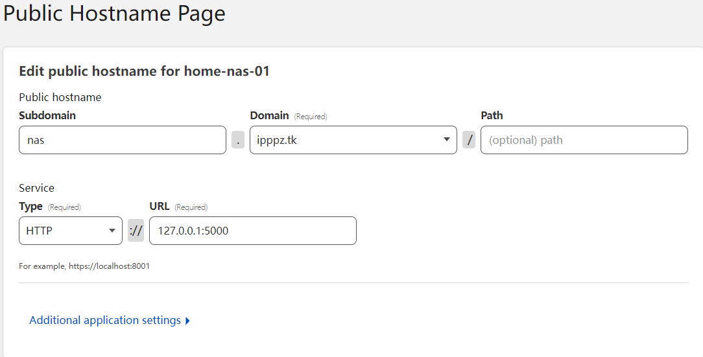
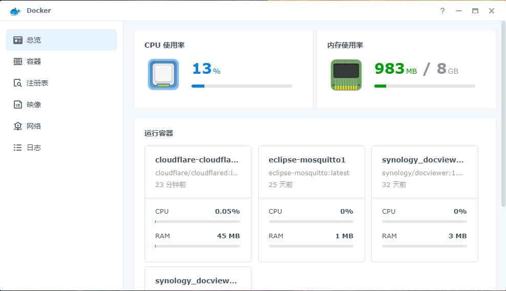
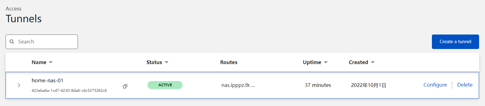

Cloudflare Tunnel可以实现通过域名访问本地暴露的服务功能，类似frp做的隧道，但是不用自己搭建服务端，只要配置好客户端即可。[doc link](https://developers.cloudflare.com/cloudflare-one/connections/connect-apps/)

下面说一下配置方式。

# 1、Dashboard创建tunnel

首先给出官方教程，熟悉英文的可以直接看 [link](https://developers.cloudflare.com/cloudflare-one/connections/connect-apps/install-and-setup/tunnel-guide/remote/#1-create-a-tunnel)

去到 [Zero Trust dashboard](https://dash.teams.cloudflare.com/)，在Access > Tunnels创建tunnel。

1. 先取个名字
2. public hostname 里添加自定义subdomain，domain选择在cloudflare绑定过的域名。

> 如果cloudflare没有创建过website，在[这里](https://developers.cloudflare.com/fundamentals/get-started/setup/add-site/)创建。需要自行申请一个域名，推荐[freenom](https://www.freenom.com/zh/index.html?lang=zh)，然后修改域名nameserver为cloudflare的，这样这个域名就可以由cloudflare管理了。

3. service选择你要的服务，一般是http，然后地址一般是写127.0.0.1+本地服务端口号，如`127.0.0.1:5000`。保存后这个website自动添加dns解析到你的本地机器。

> 这里不再需要去域名dns处手动添加了，他自动添加好了
   

# 2、运行cloudflared客户端

我使用的是群晖nas+docker版，主要是图形化的docker怎么运行cloudflared。

1. 下载docker套件

2. 在注册表里搜索cloudflared并下载
3. 开启容器，需要配置两个地方
   - 环境变量添加`TUNNEL_TRANSPORT_PROTOCOL`，值为`http2`，因为默认的quic协议国内不支持，需要改成http2
   - 下方命令输入创建tunnel时docker下的提示部分，如`docker run cloudflare/cloudflared:latest tunnel --no-autoupdate run --token eyJhIjoiZjYyMDUyMjxxxxx`你就复制`tunnel --no-autoupdate run --token eyJhIjoiZjYyMDUyMjxxxxx`进去
4. [Zero Trust dashboard](https://dash.teams.cloudflare.com/)的tunnel里看到active就说明连上了

# 3、访问subdomin就会代理到你本地的服务

如我的nas域名设置了`https://nas.ipppz.tk/`，并转发到nas的5000端口，接下来就直接用域名访问即可，也是支持https的。
