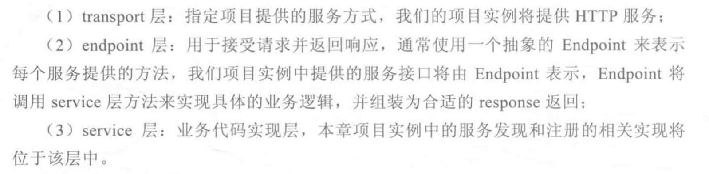

# go-kit的三层结构

go-kit项目采用分层架构方式。

- transport层：处理http、grpc等逻辑。比如在http中就是返回一个http.Handler，里面包含了URL和对应处理器的关系
- endpoint层：用于接受请求，处理请求，返回响应。每个服务都会包装成一个endpoint，在endpoint中调用service的方法，最后返回组装好的response。类似Java中controller的写法，不过这里没有涉及URL路径，只是提供包装后的服务。
- service层：业务代码实现层，也就是定义了有什么服务，服务的具体实现。

代码中使用了go-kit的函数，影响较大的是endpoint层和transport层。写法和我们普通分层写不太一样，用了很多go-kit的API。下面我们先从service层讲起。

## service层

作为服务端，如果想要使用服务注册和发现中心，比如consul，那么服务端需要有这三个功能，**我们抽象为一个接口：**

    type DiscoveryClient interface {

        /**
        * 服务注册接口
        * @param serviceName 服务名
        * @param instanceId 服务实例Id
        * @param instancePort 服务实例端口
        * @param healthCheckUrl 健康检查地址
        * @param instanceHost 服务实例地址
        * @param meta 服务实例元数据
        */
        Register(serviceName, instanceId, healthCheckUrl string, instanceHost string, instancePort int, meta map[string]string, logger *log.Logger) bool

        /**
        * 服务注销接口
        * @param instanceId 服务实例Id
        */
        DeRegister(instanceId string, logger *log.Logger) bool

        /**
        * 发现服务实例接口
        * @param serviceName 服务名
        */
        DiscoverServices(serviceName string, logger *log.Logger) []interface{}
    }

- Register用于把自己注册到consul
- DeRegister用于向consul注销自己的服务
- DiscoverServices用于向consul请求别的服务

对应可以有自己的接口实现，比如定义MyDiscoverClient结构，然后实现DiscoveryClient接口，如注册方法可以自己写http请求，发送到consul注册；或者定义KitDiscoverClient结构，然后实现DiscoveryClient接口，调用go-kit的consul client进行快速注册。

简单贴一个注册方法的go-kit实现：

    func (consulClient *KitDiscoverClient) Register(serviceName, instanceId, healthCheckUrl string, instanceHost string, instancePort int, meta map[string]string, logger *log.Logger) bool {

        // 1. 构建服务实例元数据
        serviceRegistration := &api.AgentServiceRegistration{
            ID:      instanceId,
            Name:    serviceName,
            Address: instanceHost,
            Port:    instancePort,
            Meta:    meta,
            Check: &api.AgentServiceCheck{
                DeregisterCriticalServiceAfter: "30s",
                HTTP:                           "http://" + instanceHost + ":" + strconv.Itoa(instancePort) + healthCheckUrl,
                Interval:                       "15s",
            },
        }

        // 2. 发送服务注册到 Consul 中
        err := consulClient.client.Register(serviceRegistration)

        if err != nil {
            log.Println("Register Service Error!")
            return false
        }
        log.Println("Register Service Success!")
        return true
    }

**第二个接口是Service接口**，包含你可以提供什么服务，比如连接字符串，比如心跳检查，比如发现服务。如：

    type Service interface {

        // HealthCheck check service health status
        HealthCheck() bool

        // sayHelloService
        SayHello() string

        //  discovery service from consul by serviceName
        DiscoveryService(ctx context.Context, serviceName string) ([]interface{}, error)

    }

然后提供自己的结构实现，如DiscoveryServiceImpl，这个结构里也可以包含上面提到的DiscoveryClient实例，这样就可以复用DiscoveryClient的实现了：

    //定义接口实现的结构
    type DiscoveryServiceImpl struct {
        discoveryClient discover.DiscoveryClient
    }

    //定义工厂方法，其实不要也可以
    func NewDiscoveryServiceImpl(discoveryClient discover.DiscoveryClient) Service  {
        return &DiscoveryServiceImpl{
            discoveryClient:discoveryClient,
        }
    }

    //下面是实现接口的方法

    func (*DiscoveryServiceImpl) SayHello() string {
        return "Hello World!"
    }

    func (service *DiscoveryServiceImpl) DiscoveryService(ctx context.Context, serviceName string) ([]interface{}, error)  {

        instances := service.discoveryClient.DiscoverServices(serviceName, config.Logger)

        if instances == nil || len(instances) == 0 {
            return nil, ErrNotServiceInstances
        }
        return instances, nil
    }

    // HealthCheck implement Service method
    // 用于检查服务的健康状态，这里仅仅返回true
    func (*DiscoveryServiceImpl) HealthCheck() bool {
        return true
    }

通过上面的工厂方法NewDiscoveryServiceImpl，可以构建出一个Service的实现，用于调用自己的各种service

	// 声明并初始化 Service
	var svc = service.NewDiscoveryServiceImpl(discoveryClient)

接下来是要把服务暴露出来，一个很简单的方法是通过URL暴露，比如将GET的/say-hello映射到Service的sayHello方法上，也就是HTTP服务器里用处理器去处理URL请求。但是go-kit使用了endpoint的概念，把服务称为endpoint，其中不包含对应的URL。

URL和endpoint的绑定我们放在了transport层实现。

## endpoint层

首先介绍endpoint层。每个服务都是一个endpoint，所以构建一个机构，包含所有的服务（endpoint）：

    type DiscoveryEndpoints struct {
        SayHelloEndpoint	endpoint.Endpoint
        DiscoveryEndpoint	endpoint.Endpoint
        HealthCheckEndpoint endpoint.Endpoint
    }

上面的endpoint.Endpoint其实就是一个函数别名：

    func(ctx context.Context, request interface{}) (response interface{}, err error)

也就是说，DiscoveryEndpoints是包含了几个函数的结构，这几个函数也就是提供请求响应服务的。

然后需要定义每个服务的请求结构、响应结构，如：

> SayHelloEndpoint-->SayHelloRequest、SayHelloResponse
>
> DiscoveryEndpoint-->DiscoveryRequest、DiscoveryResponse
>

每个结构里就是你需要传递的数据字段，没有的话就空，同时要指明json序列化tag：

    // 打招呼请求结构体
    type SayHelloRequest struct {
    }
    // 打招呼响应结构体
    type SayHelloResponse struct {
        Message string `json:"message"`
    }

然后是写函数返回这个具体的endpoint，可以看到就是返回一个函数，最后返回的是SayHelloResponse：

    // 创建打招呼 Endpoint
    func MakeSayHelloEndpoint(svc service.Service) endpoint.Endpoint {
        return func(ctx context.Context, request interface{}) (response interface{}, err error) {
            message := svc.SayHello()
            return SayHelloResponse{
                Message:message,
            }, nil
        }
    }

如果有请求数据，如何从请求中获取？

可以从request对象中转成你这个endpoint对应的请求结构，如`req := request.(DiscoveryRequest)`，这样就可以用结构里的数据了。

    // 创建服务发现的 Endpoint
    func MakeDiscoveryEndpoint(svc service.Service) endpoint.Endpoint {
        return func(ctx context.Context, request interface{}) (response interface{}, err error) {
            req := request.(DiscoveryRequest)
            instances, err := svc.DiscoveryService(ctx, req.ServiceName)
            var errString = ""
            if err != nil{
                errString = err.Error()
            }
            return &DiscoveryResponse{
                Instances:instances,
                Error:errString,
            }, nil
        }
    }

你可能会有疑问，为什么request直接可以转成对应的请求结构，是如何转的呢？这在后面会提到，系统会使用我们提供的反序列化方法，将请求decode为我们设计的请求结构。同理，最后response结构如何序列化发送给客户端？也是调用了我们提供的序列化方法。

至此，endpoint构建完毕

## transport层

如在http服务中，我们可以构建一个函数返回Handler。区别于直接提供给URL一个处理器或处理器函数，这边我们使用kithttp提供的处理器。

我们需要提供几个参数去构建这个处理器：

- endpoint：服务处理函数，如endpoints.SayHelloEndpoint
- 请求解码函数：如decodeSayHelloRequest
- 响应编码函数：如encodeJsonResponse
- 处理器选项

看看第一个服务是如何暴露的：

- 映射GET的/say-hello到一个处理器
- 这个处理器包含endpoints.SayHelloEndpoint用于处理请求，并返回响应
- 包含decodeSayHelloRequest用于将请求解码到SayHelloRequest
- 包含encodeJsonResponse用于将SayHelloRequest转为JSON格式
- 最后包含几个错误处理的方式

see：

    // MakeHttpHandler make http handler use mux
    func MakeHttpHandler(ctx context.Context, endpoints endpts.DiscoveryEndpoints, logger log.Logger) http.Handler {
        r := mux.NewRouter()

        options := []kithttp.ServerOption{
            kithttp.ServerErrorHandler(transport.NewLogErrorHandler(logger)),
            kithttp.ServerErrorEncoder(encodeError),
        }

        r.Methods("GET").Path("/say-hello").Handler(kithttp.NewServer(
            endpoints.SayHelloEndpoint,
            decodeSayHelloRequest,
            encodeJsonResponse,
            options...,
        ))

        r.Methods("GET").Path("/discovery").Handler(kithttp.NewServer(
            endpoints.DiscoveryEndpoint,
            decodeDiscoveryRequest,
            encodeJsonResponse,
            options...,
        ))

        // create health check handler
        r.Methods("GET").Path("/health").Handler(kithttp.NewServer(
            endpoints.HealthCheckEndpoint,
            decodeHealthCheckRequest,
            encodeJsonResponse,
            options...,
        ))

        return r
    }

当然上面提到的请求解码函数和响应编码函数都是自己写的，函数签名要遵照不同格式哦：

    // decodeSayHelloRequest decode request params to struct
    func decodeSayHelloRequest(_ context.Context, r *http.Request) (interface{}, error) {
        return endpts.SayHelloRequest{}, nil
    }

    // decodeDiscoveryRequest decode request params to struct
    func decodeDiscoveryRequest(_ context.Context, r *http.Request) (interface{}, error) {
        serviceName := r.URL.Query().Get("serviceName")
        if serviceName == ""{
            return nil, ErrorBadRequest
        }
        return endpts.DiscoveryRequest{
            ServiceName:serviceName,
        }, nil
    }

    // decodeHealthCheckRequest decode request
    func decodeHealthCheckRequest(ctx context.Context, r *http.Request) (interface{}, error) {
        return endpts.HealthRequest{}, nil
    }

    // encodeJsonResponse encode response to return
    func encodeJsonResponse(ctx context.Context, w http.ResponseWriter, response interface{}) error {
        w.Header().Set("Content-Type", "application/json;charset=utf-8")
        return json.NewEncoder(w).Encode(response)
    }

# main函数调用

处理流程如下

1. 读取consulHost, consulPort
2. 用上述参数构建discoveryClient
3. 用discoveryClient构建service
4. 用service构建若干个endpoints
5. 用若干个endpoints构建transport的handler
6. 向consul注册自己
7. 用handler和端口构建并开启http服务
8. 监听到终止信号则向consul取消注册，并退出服务

注册时候有个问题，向服务中心注册时只要提交instanceId、serviceName、instanceHost、instancePort等信息，但是不包含结构化的有什么服务，服务对应的URL是什么，别人通过服务名查询到该实例，知道该实例的host和port，但是接下来怎做？我还是不知道你提供什么服务啊，不知道服务在哪个URL。

然后调用别人的服务也是手动发送http请求吗。

学了grpc之后，明白rpc是解决微服务之间的调用问题，而服务的注册和发现是这一章解决的，如何将二者结合？比如某个rpc服务向服务中心注册，然后客户端查询“XXX”服务，获得“XXX”服务的地址和端口，然后建立rpc连接，用rpc去调用。这是一个比较合理的逻辑。

即服务中心解决服务在哪的问题，RPC解决服务调用、返回的问题

