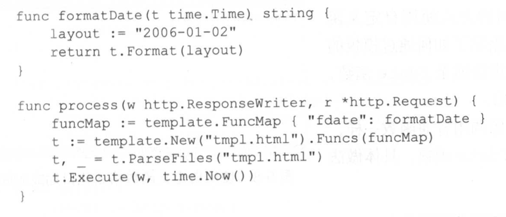
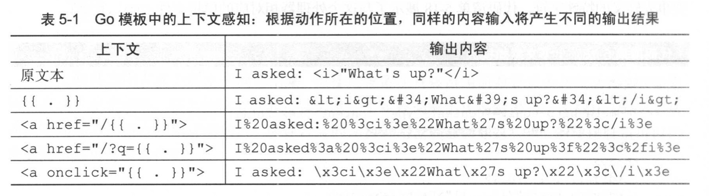

- [如何读取模版并返回HTML](#如何读取模版并返回html)
- [template里的动作](#template里的动作)
  - [1. 条件动作](#1-条件动作)
  - [2. 迭代动作](#2-迭代动作)
  - [3. 设置动作](#3-设置动作)
  - [4. 包含动作](#4-包含动作)
- [参数](#参数)
- [变量](#变量)
- [管道](#管道)
- [函数](#函数)
- [上下文感知](#上下文感知)
  - [取消HTML转义](#取消html转义)
- [嵌套模板](#嵌套模板)
  - [块模板](#块模板)

# 如何读取模版并返回HTML

模版中的动作默认使用{{和}}包围，也可以自行修改界定符。`{{.}}`指的是用传入的值替换这个动作本身。

go web的模版引擎使用方法分为以下两个步骤：

- 读取文本模版文件（或一个模版字符串），进行语法分析，创建一个模版结构。
- 将数据传入，执行模版，生成HTML。

第一个步骤：
    
    //从文件中生成模版
    t,_ := template.ParseFiles("index.html")

    //读取多个文件，但是只生成第一个文件的模板（因为第一个模版可能调用其他模版）
    t,_ := template.ParseFiles("index.html","content.html","navbar.html")

    //从字符串中生成模版
    tmpl := `...`
    t := template.New("tmpl.html")
    t,_ = t.Parse(tmpl)

第二个步骤：

    // t.Execute第一个参数是io.Writer，第二个参数是传入的数据。这个方法只会执行第一个模版，也就是index.html
    t,_ := template.ParseFiles("index.html","content.html","navbar.html")
    t.Execute(w,"hello world")

    //如果想要执行其他模板，用t.ExecuteTemplate,并在第二个参数指定模版名称
    t,_ := template.ParseFiles("index.html","content.html","navbar.html")
    t.ExecuteTemplate(w,"content.html","hello world")

如果你只是在html中加入一些{{.}}的指令，模板的名称和文件名称一样，当然也可以重新定义模版的名字，或在一个模板文件中定义多个模板。

**讲了这么多还不知道模版文件怎么写呢。下面讲讲动作语法。**

# template里的动作

如果要访问结构里的field，用：`{{ .Name }}`，或 `{{ .User.Name }}`

## 1. 条件动作

接受true或false，从而决定执行（显示）哪条语句。下面如果传入true，则会显示content1语句。

    {{ if . }}
        content1
    {{ else }}
        content2
    {{ end }}

## 2. 迭代动作

可对传入的数组、切片、映射、或通道进行迭代，迭代里，`.`会被设置为当前迭代的元素.`else`用于当迭代的结构为空或nil时显示备选结果。

    {{ range . }}
        <li>The Elem: {{ . }} </li>
    {{ end }}

    {{ range . }}
        <li>The Elem: {{ . }} </li>
    {{ else }}
        <li> No elems. </li>
    {{ end }}

## 3. 设置动作

类似if，`{{if pipeline}} T1 {{end}}`,如果pipeline为空（false，0，nil，空的array, slice, map,string），则执行T0，否则执行T1.同时with里面{{.}}会被设置为pipeline的值。这是和if唯一的区别。

    {{with pipeline}} T1 {{end}}
    {{with pipeline}} T1 {{else}} T0 {{end}}

可以用来判断当某个集合为空时，显示xxx话。当不为空时，在with里用dot显示这个集合里的东西。

## 4. 包含动作

可以在一个模板里包含另一个模板，用到`{{ template "name" }}`,或`{{template "name" pipeline}}`

第一个参数是模板的名字（如果没定义，那就是模板文件名称），第二个参数是要传给这下一个模板的参数。

通常这么用：`{{template "name" . }}`

# 参数

上述的if后边跟的就是arg参数，这边传了dot过去。

    {{ if . }}
        content1
    {{ else }}
        content2
    {{ end }}

arg可以是一个值，一个变量，或一个返回一个值的函数。

如：

    {{ if . }} content1 {{ end }}
    {{ if $key }} content1 {{ end }}
    {{ if .IsExist }} content1 {{ end }}

# 变量

可以在动作中设置变量：`$key := something`,如：
    
    {{ range $key, $value := . }}
        <li>{{ $key }} : {{ $value }} </li>
    {{ end }}

# 管道

管道可以串联参数和函数、方法。如

    {{ p1 | p2 | p3 }}

这三者都是参数。

    {{ 123.456 | printf "%.2f" }}

将123.456传给**模板内置printf函数**

当然函数也可以通过后置参数调用：

    {{ printf "%.2f" 123.456 }}

# 函数

模板引擎里的内置函数虽然可以接受多个参数，但是只能返回一个值，或返回一个值+一个错误。内置函数列表见 https://pkg.go.dev/text/template#hdr-Functions

用户可以自定义函数并传入模板，步骤如下：

1. 创建一个FuncMap，并传入`函数名称：真的函数名`，后面模板里就用函数名称进行调用
2. 将FuncMap和模板绑定
   

调用：

    {{ . | fdate }}
    或
    {{ fdate . }}

还有些参数、变量、管道和函数这里先略过。

# 上下文感知

go模板里动作的输出会根据所处的上下文改变输出形态，如

- {{ . }}在HTML处，会将输出进行html转译后输出
- {{ . }}在href或src处，会将输出进行URL转译后输出

这主要用于实现自动防御编程，可以抵御XSS攻击。

## 取消HTML转义

使用`template.HTML()`包裹值并传入模板即可。如`template.HTML(r.FormValue("comment"))`

# 嵌套模板

通常我们会在网站开发中复用某套layout，如有导航栏，服务器状态，版权声明。然后中间是展示的内容。如果要实现内容替换而其他东西复用，我们就不能使用默认的模板名字。比如下面这个lauout.html

    <!DOCTYPE html>
    <html lang="en">
    <head>
        <meta charset="utf-8">
        <meta http-equiv="X-UA-Compatible" content="IE=9">
        <meta name="viewport" content="width=device-width, initial-scale=1">
        <title>ChitChat</title>
    </head>
    <body>
        {{ template "content.html" }}
    </body>
    </html>

这里嵌套了"content.html"模板。问题是只有唯一一个"content.html"，这么写除了把一个文件拆成两个文件，无法复用layout.html。于是我们可以定义模板名称，而不是用默认的文件名：

    <!DOCTYPE html>
    <html lang="en">
    <head>
        <meta charset="utf-8">
        <meta http-equiv="X-UA-Compatible" content="IE=9">
        <meta name="viewport" content="width=device-width, initial-scale=1">
        <title>ChitChat</title>
    </head>
    <body>
        {{ template "content" }}
    </body>
    </html>

然后在index.html中定义一个模板为content：

    {{ define "content" }}
        

        <a href="/thread/new">Start a thread</a> or join one below!
        

    {{ end }}

parseFiles时传入layout.html和index.html，就可以实现模板嵌入。

同理，我们还可以定义另一个login.html,并在其中定义content：

    {{ define "content" }}
        <a href="/login">Login！</a> 
    {{ end }}

parseFiles时传入layout.html和login.html，就可以实现另一个模板的嵌入。

如果模板名字不同，也可以在同一个文件里定义多个不同的模板；可以在多个文件里定义同名模板。

## 块模板

这是另一种定义模板的方法。主要用于直接在一个模板中定义新的模板，并且作为缺省模板使用。

    {{ define "layout" }}
        hello
        {{ block "content" . }}
            
someone!

        {{ end }}
    {{ end }}

如果在parseFiles时没有传入额外的content模板，则会使用layout里定义的content块作为缺省使用。
