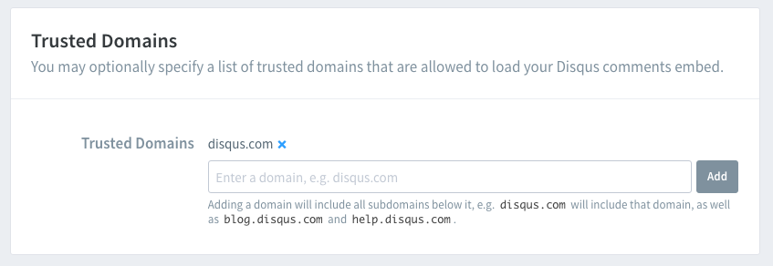

[stack](https://github.com/CaiJimmy/hugo-theme-stack)是本blog使用的hugo主题，今天研究了一下如何配置disqus功能。

stack本身支持多种comments系统，只要在config配置下即可。

> 可以从[文档](https://stack.jimmycai.com/config/comments)开始,然后看DisqusJS的[介绍](https://github.com/SukkaW/DisqusJS)。

1. 先在Disqus注册APP，然后在 [Disqus API Application](https://disqus.com/api/applications/)处注册一个 Application。

2. 获取API Key ，添加domain。

3. 在[Advanced](https://chrisblog-2.disqus.com/admin/settings/advanced/)这里还要加个doamin。



4. 然后主要修改config以下几个地方：

- 根目录下的disqusShortname，从[这里获取](https://disqus.com/admin/settings/general/)，这边文档给了WARNING，说是必须从这里修改，不然无法起作用，确实是这样。
- comment下的disqusjs:
apiUrl抄我这个就可以。apiKey和shortname用你自己的，不确定shortname这边还有没有必要填。
```
    disqusjs:
      shortname: chrisblog-2
      apiUrl: https://disqus.com/api/
      apiKey: xxxxxx
      admin:
      adminLabel:
```

最后结果可以看下面的评论区效果，可以登录disqus账号来发评论，admin可以在disqus中管理评论，估计也可以配置发送邮件。

