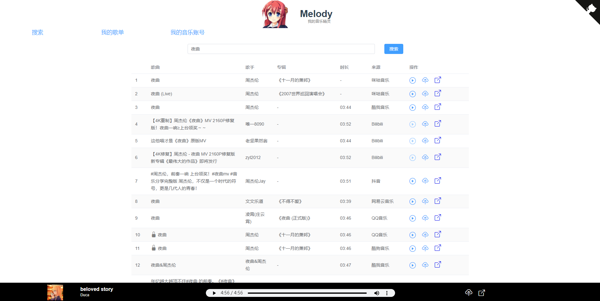

## 文章

**1、[学习编程难？先解决量的问题](https://catcoding.me/p/entry-for-learning-programming/)**

> 就编程来说，三万行代码这么明确的一个指标，实际上大部分人做不到。以大多数人的努力程度之低，根本轮不到拼天赋。不信你可以问问，即使是大学计算机专业的学生，很多人毕业的时候并未完成过 3 万行有效编程的这个量。

作者从大学的5w行代码培养了编程的手感，学习任何技能的前期都需要一定量的积累，我们要做的是找到有效练习的方式，持续投入再阶段性回顾。

而不是在量没达到的时候怀疑方法论，放弃坚持下去。这个量就像门槛。

## 工具

**1、[Melody音乐搜索和上传网站（开源）](https://github.com/foamzou/melody)**

可以实现多平台音乐搜索播放、上传云盘、账号歌单同步功能，另外支持bilibili链接音频解析。